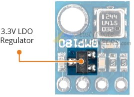
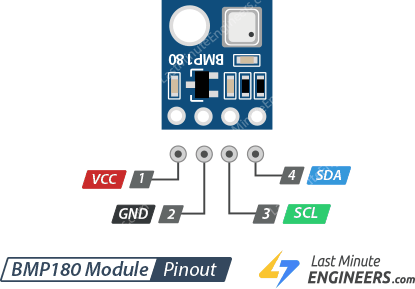
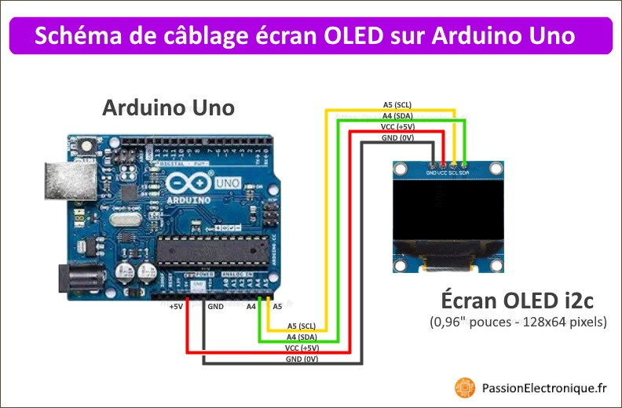
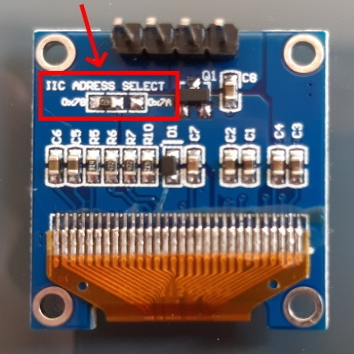
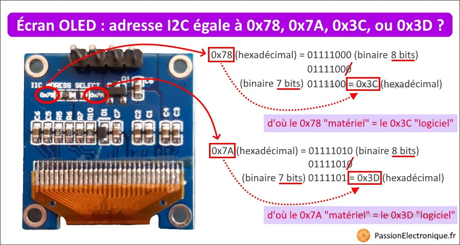
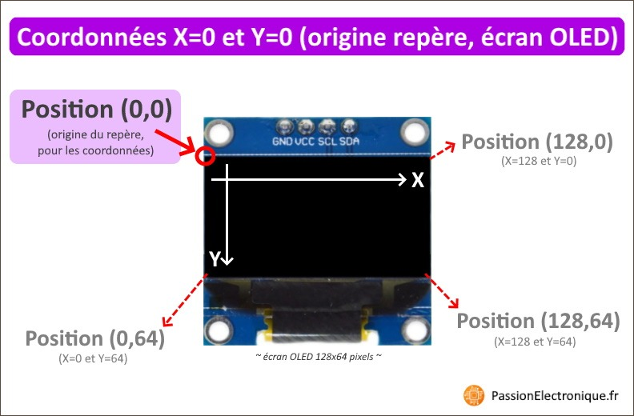

# Embedded meteo station
## Introduction
This is a mini meteo station using an **esp8266** as microprocessor processed with Arduino and two others components. A **BMP180** for retrieved temperature and pressure as well as a **OLED** screen for displayed data.

## Components
### esp8266
The **esp8266** is as low-cost **Wi-Fi** microcontroller, with built-in **TCP/IP networkin software, and microcontroller capability.
#### Features
- **Processor**: L106 32-bit **RISC** microprocessor core based on the **Tensilica** Diamond Standard 106Micro running at 80 or 160MHz
<ul>
	<li><b>Memory</b>:
		<ul>
			<li>32 KiB instruction RAM</li>
			<li>32 KiB instruction cache RAM</li>
			<li>80 KiB user-data RAM</li>
			<li>16 KiB ETS system-data RAM</li>
		</ul>
	</li>
</ul>

- **External QSPI flash**: up to 16 MiB is supported (512 KiB to 4 MiB typically included)
<ul>
	<li><b>IEEE 802.11 WiFi</b>:
		<ul>
			<li>Integrated <b>TR switch, balun, LNA, power amplifier</b> and <b>matching network</b></li>
			<li><b>WEP</b> or <b>WPA/WPA2</b> authentication, or open networks</li>
		</ul>
	</li>
</ul>

- 17 **GPIO** pins
- **I²C** (software implementation)
- **I²S** interfaces with DMA (sharing pins with GPIO)
- **UART** on dedicated pins, plus a transmit-only UART can be enabled on GPIO2
- 10-bit **ADC**

### BMP 180
As **BMP180** is a basic sensor that is designed specifically for measuring atmospheric pressure, which is really useful for two things.

- **BMP180** can determined the altitude by measuring the pressure. It can be use as an **Altimeter**.

- And because the atmospheric pressure changes with the weather, we can use it to **monitor changes in the weater**.

Fairly simple to use, pre-calibrated and don’t require extra components.

#### Hardware
| Barometric pressure | Temperature | Altitude |
| ------------------- | :----------- | :-------- |
|300 to 1100 hPa (9000m to -500m above sea level) with ±1hPa accuracy| -40°C to 85°C with ±1.0°C accuracy | 0 to 30.000ft with ±1m accuracy |

> The pressure measurements are so precise (low altitude noise of 0.25m), you can even use it as an altimeter with ±1 meter accuracy.

#### Power requirement
The module comes with an on-board **LM6206 3.3V** regulator, it can be use with a 5V logic microcontroller like **Arduino**.

> Consumes less than 1mA during measurement and only 5µA during idle. This low power consumption allows the implementation in battery driven devices.

#### I²C Interface
The module features a simple **two-wire I²C interface** which can be easily interfaced with *any microcontroller*.
___

ℹ️ This module has a **hardwired I²C address** and is set to **0x77HEX**.

#### BMP 180 Module Pinout

- ***VCC** —* is the power supply for the module. 3.3V **≥** 5V
- ***GND** —* should be connected to the *ground* of Arduino
- ***SCL** —* is a *serial clock pin* for **I²C** interface
- ***SDA** —* is a *serial data pin* for **I²C** interface

#### Install BMP 180
Calculating the altitude and barometric pressure with BMP180 module needs a lot of math. Fortunately, Adafruit BMP180 Library was written to hide away all the complexities so that we can issue simple commands to read the temperature, barometric pressure and altitude data.
- Adafruit BMP180 Library by **Arduino**

### OLED i²C
#### OLED I²C Screen (monochrome, chipset SSD1306) characteristic
**OLED screens** are graphic displays that can be *monochrome* or *multi-color,* and are used to display *texte*, *pictures,* and *graphical forms.* These screens generally *include* *a* *controller,* which facilitate the interfaces between the **OLED screen** itself and the *command* *unit* (e.g. ***Arduino***).

Regarding communication with the **OLED screen,** there are ***two main communication protocols*** used:

- **I²C bus —** *uses 2 wires: **SDA** and **SCL***
- **SPI bus —** *uses 4 wires: **SCK, MOSI, MISO,** and **SS,** to note **D0, D1, DC** and **CS***

Concerning the electronic power supply, it is generally powered between **3.3** to **5V.** Of course,there may be exceptions. It’s important to verify your with your own *electronic component supplier* or *manufacturer.*

- **Avantages — OLED technology** offers excellent visibility, which means we can easily read everything display on it, even when *viewing it from an angle.* Furthermore, there is no need ***backlighting*** whatsoever.
- **Disadvantages — OLED screen** are often (too) small. There are not usually easy to implement in a case, despite the presence of *mounting holes*. Additionally, many are *monochrome.*

#### How to connect

The display is connected by utilizing the **I²C** pins on Arduino.

Which pins to use for this differs on some Arduino models, but on the **UNO** and **NANO** you use pin **A4** (***SDA**)* and **A5** *(**SCL**).* If it’s not concerning your Arduino, check on google the pinout and look for **SDA** and **SCL** pins.

| **Type of Arduino** | **SDA Pin** | **SCL Pin** |
| --------- | --------- | --------- |
| esp8266 | Pin GPIO 1 | Pin GPIO 2 |
| Arduino Uno | Pin A4 | Pin A5 |
| Arduino Nano | Pin A4 | Pin A5 |
| Arduino Mega | Pin 20 | Pin 21 |
| Arduino Pro Mini | Pin A4 | Pin A5 |

#### What is the I²C address of the OLED screen: 0x3C, 0x3D, 0x78, or 0x7A?
Commonly used in electronic, you will see an address appearing on the back of the OLED display that is absolutely not the address to use in the Arduino program.

We noted two possible **I²C** addresses **: 0x78** or **0x7A.**  However :

- If we use the **0x78** or **0x7A** address in our Arduino code program, we will see that nothing works.
- And if we use **I²C 0x3C** ou **0x3D,** then the **OLED screen** respond to your commands with one of these addresses.

Now, if I say **0x78** is equivalent to **0x3C,** and **0x7A** is equivalent to **0x3D,** it may seem nonsensical.

Here’s how to understand it:

- In **I²C** communication, we work with **7 bits** and not  **8 bits.**. This means we have integer values ranging from **0** to **127** (or **0x00** to **0x7F** in hexadecimal, or **000 0000** to **111 1111** in binary)
- For instance, an **8 bits** address of ***0x78*** correspond to the binary number **0111 1000.**
When converting this **8-bit** number to a **7-bit** address for **I²C** addressing, we only retain the most significant 7 bits (**MSB**), discarding the least significant bit.
This results in the binary number **0111 100**, which is equivalent to **0x3C** in hexadecimal.
Therefore, the **8-bit** address **0x78** corresponds to the **7-bit** **I²C** address **0x3C**.
- Similarly, an 8-bit address of **0x7A** gives the binary number **01111010**. However, if we convert this 8-bit word to a 7-bit MSB word, we again "lose" the last digit. This results in the number **0111101**, when written in 7 bits, by retaining only the most significant bits. And this binary value indeed gives us **0x3D** in hexadecimal! Thus, the physical address **0x7A** in 8 bits is equivalent to the software address **0x3D** in 7 bits!

**N.B.**

For knowing the correct address, we could :

- Refer to the manufacturer’s documentation
- Use the **I²C** scanner
- Or simply convert the values visible on the **OLED screen PCB.**

#### The origin of the marker (X and Y coordinates)
Another things to know — the origin of the marker allowing to define X and Y axes to our OLED screen.

#### Install OLED I²C
To control an **OLED screen** with an Arduino, there are many useful librairies available.

- [**U8GC Library](https://www.arduino.cc/reference/en/libraries/u8g2/)** *by Olikraus —* Very comprehensive but it is not the easiest to use when starting out.
- [**SSD1306](https://github.com/adafruit/Adafruit_SSD1306?pseSrc=pgEcranOledArduino)** *by Adafruit  ****—* Specialized for **OLED screens** equipped with an **SSD1306** controller, like the one mentioned in this article ; this library is much easier to use when beginning with an **OLED** display.

> It’s important to note that the **SSD1306 library** may required the installation of an *additional* library called the [**GFX library**](https://github.com/adafruit/Adafruit-GFX-Library?pseSrc=pgEcranOledArduino). Obviously, installing this library is necessary if we want to access all the advance functions provided by the [**Adafruit GFX library**](https://github.com/adafruit/Adafruit-GFX-Library?pseSrc=pgEcranOledArduino).
